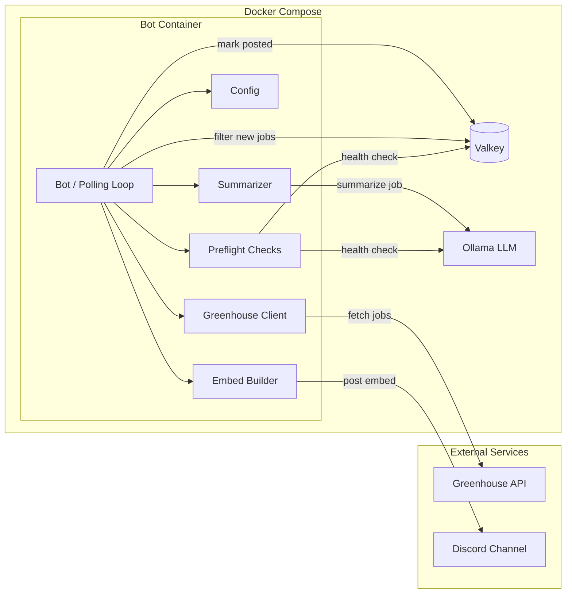

# Job Crawler

A Discord bot that fetches job postings from job boards (e.g. [Greenhouse](https://www.greenhouse.io/), [Rippling](https://www.rippling.com/)), generates AI-powered summaries via [Ollama](https://ollama.com/), and posts new listings to a Discord channel. Valkey (Redis-compatible) tracks already-posted jobs to prevent duplicates.

## Architecture



## Prerequisites

- Python 3.14+
- A Discord bot token and target channel ID
- Valkey (or Redis) instance
- Ollama instance with your preferred model

## Quickstart

### With Docker Compose

```bash
cp .env.example .env
# Edit .env with your values
docker compose up --build
```

This starts three services: the bot, Valkey, and Ollama.

### Local Development

```bash
uv sync
cp .env.example .env
# Edit .env with your values
job-crawler
```

### CLI Options

```
job-crawler              # Run the bot (polls once, posts to Discord, then exits)
job-crawler --dry-run    # Preview jobs locally without Discord
job-crawler --limit 5    # Cap the number of jobs posted per cycle
job-preflight            # Check that Valkey and Ollama are reachable
```

## Configuration

All configuration is via environment variables. See [`.env.example`](.env.example).

| Variable | Required | Default | Description |
|---|---|---|---|
| `DISCORD_TOKEN` | Yes | — | Discord bot token |
| `DISCORD_CHANNEL_ID` | Yes | — | Channel to post job listings |
| `VALKEY_URL` | No | `valkey://localhost:6379/0` | Valkey/Redis connection URL |
| `JOB_TTL_SECONDS` | No | `7776000` (90 days) | How long to remember posted jobs |
| `GREENHOUSE_BOARD_URL` | No | Temporal Technologies board | Greenhouse board API endpoint |
| `OLLAMA_BASE_URL` | No | `http://localhost:11434/v1` | Ollama API URL |
| `OLLAMA_MODEL` | No | `ministral-3` | LLM model for summarization |

## Testing

```bash
uv run pytest
```
