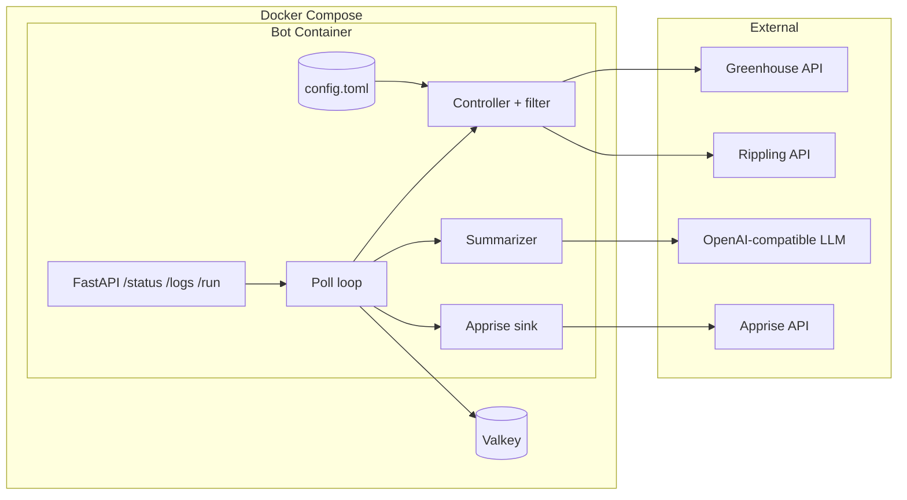

# Architecture

This document walks through how the pieces fit together and why.

## Two services, three external dependencies

The Compose file ships **two** containers:

- `bot` — the long-running crawler (poll loop + FastAPI status server in the same Python process).
- `valkey` — the dedup store.

Three things live outside Compose:

- The **LLM endpoint**. Could be Ollama on your laptop, vLLM on a GPU box, or `api.openai.com`. The bot only knows how to speak the OpenAI `/v1` chat-completions protocol.
- The **Apprise API**. A separate service that translates one HTTP POST into many destinations. The bot doesn't know or care whether the eventual destination is Discord, Slack, or email.
- The **job boards** (Greenhouse, Rippling). Public read-only APIs.

Keeping these external means the bot has no opinions about how you run them — they can be local, cloud, shared with other apps, or swapped out.

## Single process, two coroutines

`bot.py` calls `asyncio.gather` over the poll loop and the uvicorn server. They share an `httpx.AsyncClient`, a Valkey client, and a `RunnerState` object — no IPC.

The poll loop runs `poll_once`, then `await asyncio.wait_for(state.trigger.wait(), timeout=POLL_INTERVAL_SECONDS)`. That's how `POST /run` works: it sets the trigger event and the loop wakes up early.

Only one cycle runs at a time. If `/run` arrives during a cycle, the API returns `409`.

## Per-board filtering

A request to `/jobs` returns whatever the board chooses to expose. `controller.py` applies the per-board `departments` allowlist before anything reaches Valkey. This keeps the dedup store narrow — it only stores jobs you actually want to know about.

The filter is intentionally simple (case-insensitive exact match). If you need regex or fuzzy matching, that lives in your fork.

## Dedup as a Valkey TTL

Posted jobs are SET-with-EX'd by ID, default 90-day TTL. New cycles do a pipeline of `EXISTS` checks. There is no scan, no key expiry callback, no separate index — see [Deduplication strategy](deduplication.md) for why.

## Markdown out, markdown in

`notify.build_notification` produces a markdown body and a plain title. `apprise_sink.send` POSTs `{title, body, format: "markdown"}` to the Apprise API. The translation from markdown to Discord/Slack/email-rich-text happens in Apprise.

This is why we don't build Discord embeds anymore — Apprise does that work, and as a bonus we get every other notification destination Apprise supports for free.

## What's not here

- No worker queue. The crawl is small enough that a single Python coroutine per cycle is plenty.
- No database. Valkey covers everything we need to persist (posted-job set with TTL).
- No auth on the status API. It's intended for in-cluster or behind-VPN use.
- No metrics export. Logs and `/status` cover the operator surface today.
